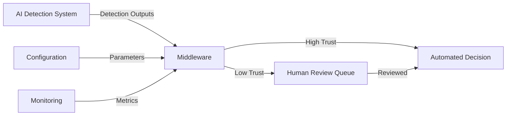

# Design Document: SafeStack AI

## Design Summary

**SafeStack AI** is a reliability middleware for AI-driven civic systems. It evaluates the stability and consistency of AI detection outputs over time and gates automation decisions based on a computed trust score.

**The system does NOT replace existing AI models, identify individuals, or make enforcement decisions.** It only determines whether automation should proceed or be held for human review.

### Key Capabilities

- **Temporal trust evaluation**: Analyzes confidence, position, and class consistency over time
- **Automation gating**: Routes decisions based on trust thresholds
- **Clear reason codes**: Explains trust degradation with specific, actionable codes
- **Human-in-the-loop decision support**: Holds uncertain decisions for review
- **Simulation-based demonstration**: Tests without real civic infrastructure

### Primary Use Case

Prevent unsafe or incorrect automated actions (e.g., false challans) under real-world conditions such as poor lighting, weather, or camera degradation.

---

*The detailed sections below describe the full system architecture, components, and validation properties.*

---

## Overview

SafeStack AI is a reliability evaluation layer that sits between AI detection systems and automated decision-making processes. It addresses the critical problem of silent AI failures in civic systems by computing trust scores based on temporal stability and confidence consistency, then gating automation decisions accordingly.

### Core Design Principles

1. **Non-invasive Integration**: SafeStack AI accepts standard detection outputs without requiring modifications to upstream AI models or downstream decision systems.

2. **Temporal Analysis**: Trust evaluation is based on analyzing detection patterns over time windows rather than single-frame assessments, capturing reliability trends.

3. **Explainability**: Every trust score reduction is accompanied by reason codes that explain what factors contributed to the decision.

4. **Configurability**: Trust thresholds, temporal windows, and evaluation parameters are configurable to support different civic applications and risk tolerances.

5. **Human-in-the-Loop**: Low-trust decisions are held for human review rather than blocked entirely, maintaining system throughput while ensuring safety.

### System Context

SafeStack AI operates in civic AI systems (e.g., traffic monitoring, parking enforcement) where:
- AI detection systems produce bounding boxes and confidence scores for objects in video frames
- Environmental conditions (lighting, weather, camera quality) vary significantly
- False automation can erode public trust and cause operational issues
- Human reviewers are available but should only handle uncertain cases

## Architecture

### High-Level Architecture



### Component Architecture

The system consists of four primary layers:

1. **Input Layer**: Receives and validates detection outputs from AI systems
2. **Analysis Layer**: Computes trust scores based on temporal patterns
3. **Decision Layer**: Gates automation based on trust thresholds
4. **Output Layer**: Routes decisions to automation or human review

### Data Flow

1. Detection outputs arrive from the AI detection system (frame-by-frame)
2. Input validator parses and validates the detection format
3. Object tracker maintains temporal state for detected objects
4. Trust evaluator computes trust scores using temporal window analysis
5. Decision gate compares trust scores against thresholds
6. High-trust decisions flow to automation; low-trust to human review queue
7. Metrics collector aggregates statistics for monitoring

## Components and Interfaces

### 1. Detection Input Handler

**Responsibility**: Receive and validate detection outputs from AI systems.

**Interface**:
```python
class DetectionInputHandler:
    def receive_detection(self, detection_json: str) -> DetectionOutput:
        """
        Parse and validate a detection output.
        
        Args:
            detection_json: JSON string containing detection data
            
        Returns:
            DetectionOutput object with parsed data
            
        Raises:
            ValidationError: If detection format is invalid
        """
        pass
    
    def validate_detection(self, detection: DetectionOutput) -> bool:
        """
        Validate that detection contains required fields and valid values.
        
        Args:
            detection: Parsed detection output
            
        Returns:
            True if valid, False otherwise
        """
        pass
```

**Validation Rules**:
- Bounding boxes must have valid coordinates (x, y, width, height)
- Confidence scores must be in range [0.0, 1.0]
- Class labels must be non-empty strings
- Timestamp must be present and monotonically increasing

### 2. Object Tracker

**Responsibility**: Maintain temporal state for detected objects across frames.

**Interface**:
```python
class ObjectTracker:
    def update(self, detection: DetectionOutput) -> List[TrackedObject]:
        """
        Update tracking state with new detection output.
        
        Args:
            detection: New detection output from current frame
            
        Returns:
            List of tracked objects with updated state
        """
        pass
    
    def get_object_history(self, object_id: str, window_size: int) -> List[Detection]:
        """
        Retrieve detection history for a tracked object.
        
        Args:
            object_id: Unique identifier for the tracked object
            window_size: Number of recent frames to retrieve
            
        Returns:
            List of detections for the object within the window
        """
        pass
```

**Tracking Strategy**:
- Use IoU (Intersection over Union) for frame-to-frame object association
- Maintain a sliding window of recent detections per object
- Handle object disappearance/reappearance with gap tolerance
- Assign unique IDs to tracked objects

### 3. Trust Evaluator

**Responsibility**: Compute trust scores based on temporal stability and confidence consistency.

**Interface**:
```python
class TrustEvaluator:
    def compute_trust_score(self, tracked_object: TrackedObject) -> TrustResult:
        """
        Compute trust score for a tracked object.
        
        Args:
            tracked_object: Object with temporal detection history
            
        Returns:
            TrustResult containing score and reason codes
        """
        pass
    
    def evaluate_confidence_stability(self, detections: List[Detection]) -> float:
        """
        Evaluate confidence score stability across detections.
        
        Args:
            detections: List of detections within temporal window
            
        Returns:
            Stability score in range [0.0, 1.0]
        """
        pass
    
    def evaluate_position_stability(self, detections: List[Detection]) -> float:
        """
        Evaluate position stability across detections.
        
        Args:
            detections: List of detections within temporal window
            
        Returns:
            Stability score in range [0.0, 1.0]
        """
        pass
    
    def evaluate_class_consistency(self, detections: List[Detection]) -> float:
        """
        Evaluate class label consistency across detections.
        
        Args:
            detections: List of detections within temporal window
            
        Returns:
            Consistency score in range [0.0, 1.0]
        """
        pass
```

**Trust Score Computation**:

The trust score is computed as a weighted combination of three factors:

```
trust_score = w1 * confidence_stability + w2 * position_stability + w3 * class_consistency
```

Where:
- `confidence_stability`: Inverse of coefficient of variation of confidence scores
- `position_stability`: Inverse of normalized position variance (bounding box centers)
- `class_consistency`: Ratio of most common class to total detections
- `w1, w2, w3`: Configurable weights (default: 0.4, 0.3, 0.3)

**Reason Code Generation**:
- `low_confidence`: Mean confidence < confidence_threshold
- `unstable_detections`: Position variance > position_threshold
- `temporal_inconsistency`: Class consistency < class_threshold
- `insufficient_data`: Fewer than minimum required detections in window

### 4. Decision Gate

**Responsibility**: Gate automation decisions based on trust scores.

**Interface**:
```python
class DecisionGate:
    def evaluate_decision(self, trust_result: TrustResult, detection: DetectionOutput) -> Decision:
        """
        Determine whether to automate or hold for review.
        
        Args:
            trust_result: Trust score and reason codes
            detection: Original detection output
            
        Returns:
            Decision object indicating automation or review
        """
        pass
    
    def should_automate(self, trust_score: float) -> bool:
        """
        Check if trust score exceeds automation threshold.
        
        Args:
            trust_score: Computed trust score
            
        Returns:
            True if automation allowed, False if review required
        """
        pass
```

**Decision Logic**:
- If `trust_score >= trust_threshold`: Allow automation
- If `trust_score < trust_threshold`: Hold for human review
- Attach trust score and reason codes to all decisions

### 5. Human Review Queue

**Responsibility**: Manage decisions held for human review.

**Interface**:
```python
class HumanReviewQueue:
    def add_review_item(self, decision: Decision, trust_result: TrustResult, detection: DetectionOutput) -> str:
        """
        Add a decision to the review queue.
        
        Args:
            decision: Decision object
            trust_result: Trust score and reason codes
            detection: Original detection output
            
        Returns:
            Unique review item ID
        """
        pass
    
    def get_next_review_item(self) -> Optional[ReviewItem]:
        """
        Retrieve the next item for human review (FIFO order).
        
        Returns:
            ReviewItem or None if queue is empty
        """
        pass
    
    def approve_item(self, item_id: str) -> None:
        """
        Mark a review item as approved and remove from queue.
        
        Args:
            item_id: Unique identifier for the review item
        """
        pass
    
    def reject_item(self, item_id: str) -> None:
        """
        Mark a review item as rejected and remove from queue.
        
        Args:
            item_id: Unique identifier for the review item
        """
        pass
    
    def get_queue_size(self) -> int:
        """
        Get the current number of items in the review queue.
        
        Returns:
            Number of pending review items
        """
        pass
```

### 6. Configuration Manager

**Responsibility**: Manage configurable trust evaluation parameters.

**Interface**:
```python
class ConfigurationManager:
    def set_trust_threshold(self, threshold: float) -> None:
        """
        Set the trust threshold for automation gating.
        
        Args:
            threshold: Value in range [0.0, 1.0]
            
        Raises:
            ValueError: If threshold is outside valid range
        """
        pass
    
    def set_temporal_window_size(self, size: int) -> None:
        """
        Set the temporal window size (number of frames).
        
        Args:
            size: Positive integer
            
        Raises:
            ValueError: If size is not positive
        """
        pass
    
    def set_confidence_threshold(self, threshold: float) -> None:
        """
        Set the minimum confidence threshold for trust evaluation.
        
        Args:
            threshold: Value in range [0.0, 1.0]
            
        Raises:
            ValueError: If threshold is outside valid range
        """
        pass
    
    def get_configuration(self) -> Configuration:
        """
        Retrieve current configuration.
        
        Returns:
            Configuration object with all parameters
        """
        pass
```

**Default Configuration**:
- `trust_threshold`: 0.7
- `temporal_window_size`: 10 frames
- `confidence_threshold`: 0.6
- `position_variance_threshold`: 50 pixels
- `class_consistency_threshold`: 0.8

### 7. Metrics Collector

**Responsibility**: Aggregate trust metrics and statistics for monitoring.

**Interface**:
```python
class MetricsCollector:
    def record_trust_score(self, trust_score: float) -> None:
        """
        Record a computed trust score for statistics.
        
        Args:
            trust_score: Trust score value
        """
        pass
    
    def record_decision(self, decision_type: str) -> None:
        """
        Record a decision (automated or review).
        
        Args:
            decision_type: "automated" or "review"
        """
        pass
    
    def record_reason_code(self, reason_code: str) -> None:
        """
        Record a reason code for statistics.
        
        Args:
            reason_code: Reason code string
        """
        pass
    
    def get_metrics(self, time_period: int) -> Metrics:
        """
        Retrieve aggregated metrics for a time period.
        
        Args:
            time_period: Time period in seconds
            
        Returns:
            Metrics object with statistics
        """
        pass
```

**Metrics Provided**:
- Average trust score over time period
- Percentage of decisions requiring human review
- Distribution of reason codes
- Detection consistency statistics
- Confidence stability statistics

### 8. Civic AI Simulator

**Responsibility**: Simulate AI detection outputs for testing and demonstration.

**Interface**:
```python
class CivicAISimulator:
    def generate_detection_sequence(self, scenario: str, num_frames: int) -> List[DetectionOutput]:
        """
        Generate a sequence of detection outputs for a scenario.
        
        Args:
            scenario: Scenario name (e.g., "stable", "degrading", "unstable")
            num_frames: Number of frames to generate
            
        Returns:
            List of detection outputs
        """
        pass
    
    def configure_scenario(self, scenario: str, params: Dict[str, Any]) -> None:
        """
        Configure parameters for a simulation scenario.
        
        Args:
            scenario: Scenario name
            params: Dictionary of scenario parameters
        """
        pass
```

**Simulation Scenarios**:
- **Stable**: High confidence, stable positions, consistent classes
- **Degrading**: Gradually decreasing confidence and increasing instability
- **Unstable**: Fluctuating confidence and positions
- **Environmental**: Simulates lighting changes, weather effects
- **Occlusion**: Objects appearing/disappearing

## Data Models

### DetectionOutput

Represents a single frame's AI detection results.

```python
@dataclass
class BoundingBox:
    x: float          # Top-left x coordinate
    y: float          # Top-left y coordinate
    width: float      # Box width
    height: float     # Box height
    
    def center(self) -> Tuple[float, float]:
        """Compute bounding box center."""
        return (self.x + self.width / 2, self.y + self.height / 2)
    
    def iou(self, other: 'BoundingBox') -> float:
        """Compute Intersection over Union with another box."""
        pass

@dataclass
class Detection:
    bbox: BoundingBox
    class_label: str
    confidence: float  # Range [0.0, 1.0]
    timestamp: float   # Unix timestamp

@dataclass
class DetectionOutput:
    frame_id: str
    timestamp: float
    detections: List[Detection]
```

### TrackedObject

Represents an object tracked across multiple frames.

```python
@dataclass
class TrackedObject:
    object_id: str
    detection_history: List[Detection]  # Sliding window of recent detections
    first_seen: float                   # Timestamp of first detection
    last_seen: float                    # Timestamp of most recent detection
    
    def get_recent_detections(self, window_size: int) -> List[Detection]:
        """Get the most recent N detections."""
        return self.detection_history[-window_size:]
```

### TrustResult

Represents the result of trust evaluation.

```python
@dataclass
class TrustResult:
    trust_score: float              # Range [0.0, 1.0]
    reason_codes: List[str]         # List of reason codes if trust is reduced
    confidence_stability: float     # Component score
    position_stability: float       # Component score
    class_consistency: float        # Component score
    timestamp: float                # When trust was computed
```

### Decision

Represents a gating decision.

```python
@dataclass
class Decision:
    decision_id: str
    decision_type: str              # "automated" or "review"
    trust_result: TrustResult
    detection: DetectionOutput
    timestamp: float
```

### ReviewItem

Represents an item in the human review queue.

```python
@dataclass
class ReviewItem:
    item_id: str
    decision: Decision
    trust_result: TrustResult
    detection: DetectionOutput
    added_timestamp: float
    status: str                     # "pending", "approved", "rejected"
```

### Configuration

Represents system configuration parameters.

```python
@dataclass
class Configuration:
    trust_threshold: float
    temporal_window_size: int
    confidence_threshold: float
    position_variance_threshold: float
    class_consistency_threshold: float
    trust_weights: Tuple[float, float, float]  # (confidence, position, class)
```

### Metrics

Represents aggregated system metrics.

```python
@dataclass
class Metrics:
    time_period: int                        # Time period in seconds
    average_trust_score: float
    review_percentage: float                # Percentage requiring review
    reason_code_distribution: Dict[str, int]  # Count per reason code
    total_decisions: int
    automated_decisions: int
    review_decisions: int
    confidence_stats: Dict[str, float]      # mean, std, min, max
    position_variance_stats: Dict[str, float]
```


## Correctness Properties

*A property is a characteristic or behavior that should hold true across all valid executions of a system—essentially, a formal statement about what the system should do. Properties serve as the bridge between human-readable specifications and machine-verifiable correctness guarantees.*

### Input Validation Properties

**Property 1: Valid detection parsing**
*For any* valid detection output in JSON format with bounding boxes, class labels, and confidence scores, SafeStack AI should successfully parse it without errors.
**Validates: Requirements 1.1, 1.4**

**Property 2: Invalid detection rejection**
*For any* malformed detection output (missing fields, invalid coordinates, out-of-range confidence scores), SafeStack AI should reject it and return a descriptive error message.
**Validates: Requirements 1.2**

**Property 3: Temporal ordering preservation**
*For any* sequence of detection outputs with monotonically increasing timestamps, SafeStack AI should maintain the same temporal ordering in its internal state.
**Validates: Requirements 1.3**

### Trust Score Computation Properties

**Property 4: Trust score bounds**
*For any* sequence of detection outputs within a temporal window, the computed trust score should always be in the range [0.0, 1.0].
**Validates: Requirements 2.1**

**Property 5: High confidence increases trust**
*For any* two detection sequences that differ only in confidence scores, the sequence with consistently higher confidence scores should produce a higher trust score.
**Validates: Requirements 2.2**

**Property 6: Position instability decreases trust**
*For any* two detection sequences that differ only in position variance, the sequence with higher position variance should produce a lower trust score.
**Validates: Requirements 2.3**

**Property 7: Class changes decrease trust**
*For any* two detection sequences that differ only in class consistency, the sequence with class changes should produce a lower trust score than the sequence with consistent classes.
**Validates: Requirements 2.4**

**Property 8: Confidence fluctuation decreases trust**
*For any* two detection sequences that differ only in confidence variance, the sequence with higher confidence variance should produce a lower trust score.
**Validates: Requirements 2.5**

**Property 9: Incremental trust computation**
*For any* sequence of detection outputs, processing them incrementally (one at a time) should produce the same final trust score as processing them all at once.
**Validates: Requirements 2.6**

### Decision Gating Properties

**Property 10: High trust allows automation**
*For any* trust score that exceeds the configured trust threshold, the decision gate should allow automation.
**Validates: Requirements 3.1**

**Property 11: Low trust requires review**
*For any* trust score that falls below the configured trust threshold, the decision gate should hold the decision for human review.
**Validates: Requirements 3.2**

**Property 12: Review queue addition**
*For any* decision held for human review, it should appear in the human review queue with all associated data (detection output, trust score, reason codes).
**Validates: Requirements 3.3, 7.1**

**Property 13: Trust score attachment**
*For any* automated decision, the trust score should be attached to the decision output.
**Validates: Requirements 3.4**

### Reason Code Properties

**Property 14: Trust reduction requires reason codes**
*For any* trust score below 1.0, at least one reason code should be generated explaining the reduction.
**Validates: Requirements 4.1**

**Property 15: Low confidence reason code**
*For any* detection sequence where the mean confidence score is below the confidence threshold, the reason codes should include "low_confidence".
**Validates: Requirements 4.2**

**Property 16: Unstable detection reason code**
*For any* detection sequence where position variance exceeds the position threshold, the reason codes should include "unstable_detections".
**Validates: Requirements 4.3**

**Property 17: Class inconsistency reason code**
*For any* detection sequence where class labels change for the same tracked object, the reason codes should include "temporal_inconsistency".
**Validates: Requirements 4.4**

**Property 18: Multiple reason codes completeness**
*For any* detection sequence with multiple trust-reducing factors (low confidence AND unstable positions), all applicable reason codes should be present.
**Validates: Requirements 4.5**

### Configuration Properties

**Property 19: Configuration parameter application**
*For any* valid configuration parameter (trust threshold, temporal window size, confidence threshold, stability threshold) and valid value, setting the parameter should result in SafeStack AI using that value in subsequent computations.
**Validates: Requirements 5.1, 5.2, 5.3, 5.4**

**Property 20: Invalid configuration rejection**
*For any* invalid configuration value (negative numbers, out-of-range values, invalid types), SafeStack AI should reject the configuration and return a descriptive error.
**Validates: Requirements 5.5**

### Object Tracking Properties

**Property 21: Position variance computation**
*For any* tracked object with a detection history, SafeStack AI should compute position variance across the temporal window.
**Validates: Requirements 6.1**

**Property 22: Confidence variance computation**
*For any* tracked object with a detection history, SafeStack AI should compute confidence variance across the temporal window.
**Validates: Requirements 6.2**

**Property 23: Multi-object tracking independence**
*For any* set of simultaneously tracked objects, the trust score for each object should be computed independently based only on that object's detection history.
**Validates: Requirements 6.4**

### Human Review Queue Properties

**Property 24: Queue ordering (FIFO)**
*For any* sequence of review items added to the queue, retrieving items should return them in the same chronological order (first-in, first-out).
**Validates: Requirements 7.2**

**Property 25: Queue removal on review**
*For any* review item that is approved or rejected by a human reviewer, the item should be removed from the queue and not appear in subsequent retrievals.
**Validates: Requirements 7.3, 7.4**

### Real-World Conditions Properties

**Property 26: Environmental degradation reduces trust**
*For any* detection sequence where confidence scores gradually decrease over time (simulating environmental degradation), the trust score should decrease accordingly.
**Validates: Requirements 8.1, 8.2**

**Property 27: Temporary vs sustained instability**
*For any* two detection sequences with the same total instability, where one has brief instability followed by stability and the other has sustained instability, the sustained instability sequence should produce a lower trust score.
**Validates: Requirements 8.3, 8.4**

### Metrics Properties

**Property 28: Average trust score computation**
*For any* sequence of trust scores over a time period, the computed average should equal the arithmetic mean of those scores.
**Validates: Requirements 9.1**

**Property 29: Review percentage computation**
*For any* set of decisions over a time period, the review percentage should equal (number of review decisions / total decisions) × 100.
**Validates: Requirements 9.2**

**Property 30: Reason code distribution tracking**
*For any* sequence of reason codes generated over time, the distribution should accurately count the occurrences of each unique reason code.
**Validates: Requirements 9.3**

**Property 31: Metrics format consistency**
*For any* metrics request, the returned metrics should be in a structured format with all required fields (average trust score, review percentage, reason code distribution, etc.).
**Validates: Requirements 9.4, 9.5**

### Simulation Properties

**Property 32: Simulator output round-trip**
*For any* detection output generated by the simulator, it should be successfully parseable by SafeStack AI's detection input handler.
**Validates: Requirements 10.1, 10.4**

**Property 33: Scenario configuration reflection**
*For any* configured simulation scenario with specific quality parameters (confidence level, stability, environmental conditions), the generated detection outputs should reflect those parameters in their characteristics.
**Validates: Requirements 10.2, 10.3**

## Error Handling

### Error Categories

SafeStack AI defines four categories of errors:

1. **Validation Errors**: Invalid input data or configuration
2. **Processing Errors**: Failures during trust computation or tracking
3. **Queue Errors**: Issues with review queue operations
4. **System Errors**: Unexpected failures or resource issues

### Error Handling Strategy

**Validation Errors**:
- Detect at input boundaries (detection input, configuration)
- Return descriptive error messages with specific field information
- Do not modify system state on validation failure
- Examples: "Invalid confidence score: 1.5 (must be in range [0.0, 1.0])"

**Processing Errors**:
- Log errors with context (object ID, frame ID, timestamp)
- Continue processing other objects/frames when possible
- Return partial results with error indicators
- Examples: Tracking failure for one object shouldn't stop processing others

**Queue Errors**:
- Validate queue operations (item exists, valid state transitions)
- Return specific error codes for different failure modes
- Maintain queue consistency (no partial operations)
- Examples: "Review item not found", "Item already processed"

**System Errors**:
- Log with full context and stack traces
- Fail gracefully with informative messages
- Preserve system state when possible
- Examples: Memory exhaustion, file system errors

### Error Recovery

**Transient Errors**:
- Detection parsing failures: Skip frame, continue with next
- Tracking association failures: Create new tracked object
- Temporary resource issues: Retry with exponential backoff

**Permanent Errors**:
- Invalid configuration: Reject and maintain previous configuration
- Corrupted state: Reset affected component, log incident
- Unrecoverable system errors: Shutdown gracefully, preserve data

### Error Propagation

- Input validation errors propagate immediately to caller
- Processing errors are logged but don't stop the pipeline
- Queue operation errors return error codes to caller
- System errors trigger graceful shutdown procedures

## Testing Strategy

### Dual Testing Approach

The testing strategy employs both unit testing and property-based testing as complementary approaches:

**Unit Tests**: Focus on specific examples, edge cases, and integration points
- Specific detection sequences with known expected outcomes
- Edge cases: empty detections, single-frame sequences, boundary values
- Error conditions: malformed inputs, invalid configurations
- Integration: component interactions and data flow

**Property-Based Tests**: Verify universal properties across all inputs
- Generate random detection sequences with varying characteristics
- Test properties hold across 100+ randomized iterations
- Validate invariants and metamorphic relationships
- Comprehensive input coverage through randomization

### Property-Based Testing Configuration

**Testing Library**: Use `hypothesis` (Python) for property-based testing

**Test Configuration**:
- Minimum 100 iterations per property test
- Each test tagged with feature name and property reference
- Tag format: `# Feature: trust-aware-middleware, Property N: [property text]`

**Generator Strategy**:
- Detection generators: Random bounding boxes, confidence scores, class labels
- Sequence generators: Variable-length detection sequences with temporal ordering
- Scenario generators: Stable, degrading, unstable, and environmental patterns
- Configuration generators: Valid and invalid parameter combinations

### Test Coverage Requirements

**Component Coverage**:
- Detection Input Handler: Parsing, validation, error handling
- Object Tracker: Association, history management, multi-object tracking
- Trust Evaluator: Score computation, reason code generation, all three components
- Decision Gate: Threshold comparison, routing logic
- Human Review Queue: FIFO ordering, state management, removal
- Configuration Manager: Parameter validation, application, error handling
- Metrics Collector: Aggregation, statistics, format
- Simulator: Scenario generation, format compliance

**Property Coverage**:
- Each correctness property implemented as a property-based test
- Each property test references its design document property number
- All acceptance criteria covered by either property tests or unit tests

**Integration Coverage**:
- End-to-end flow: Detection input → Trust evaluation → Decision gating
- Multi-frame sequences with object tracking
- Configuration changes during operation
- Queue operations with concurrent access

### Test Data Strategy

**Synthetic Data**:
- Generated detection sequences for controlled testing
- Parameterized scenarios (stable, unstable, degrading)
- Edge cases (empty, single-frame, extreme values)

**Realistic Data**:
- Simulated traffic camera scenarios
- Environmental condition variations (lighting, weather)
- Real-world patterns (occlusion, object appearance/disappearance)

**Adversarial Data**:
- Malformed inputs for validation testing
- Boundary values for threshold testing
- Extreme sequences for stress testing

### Testing Phases

**Phase 1: Component Testing**
- Unit tests for each component in isolation
- Property tests for component-level properties
- Mock dependencies for focused testing

**Phase 2: Integration Testing**
- Component interaction testing
- End-to-end flow validation
- Property tests for system-level properties

**Phase 3: Scenario Testing**
- Realistic civic AI scenarios
- Environmental condition simulations
- Performance and stress testing

**Phase 4: Validation Testing**
- Verify all requirements covered
- Validate all properties hold
- Confirm error handling robustness
