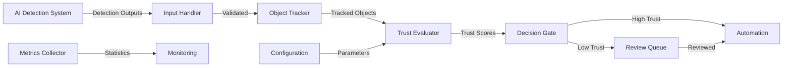

# Trust-Aware Middleware for Reliable Civic AI Systems

A middleware layer that evaluates the reliability of AI detection outputs in civic systems (like traffic cameras) using confidence stability, detection consistency, and temporal behavior. It gates automation decisions based on trust levels and provides human-in-the-loop decision support.

## Overview

The trust-aware middleware addresses the critical problem of silent AI failures in civic systems by computing trust scores based on temporal stability and confidence consistency, then gating automation decisions accordingly. When AI reliability is uncertain, the system holds decisions for human review, reducing false automation and increasing public trust in civic AI systems operating under challenging real-world conditions.

## Key Features

- **Non-invasive Integration**: Accepts standard detection outputs without requiring modifications to upstream AI models
- **Temporal Analysis**: Evaluates reliability based on detection patterns over time windows
- **Explainable Trust Scores**: Every trust score reduction is accompanied by reason codes
- **Configurable Thresholds**: Tune trust parameters for different civic applications and risk tolerances
- **Human-in-the-Loop**: Low-trust decisions are held for human review rather than blocked entirely
- **Real-time Metrics**: Track system performance and AI reliability over time

## Use Cases

- **Traffic Monitoring**: Evaluate reliability of vehicle detection before issuing automated violations
- **Parking Enforcement**: Ensure parking violation detections are trustworthy before automation
- **Crowd Management**: Monitor detection quality in varying lighting and weather conditions
- **Infrastructure Monitoring**: Track AI performance degradation over time

## How It Works

```
AI Detection System → Middleware → High Trust → Automated Decision
                          ↓
                      Low Trust → Human Review Queue → Reviewed Decision
```

1. **Detection Input**: AI detection system produces bounding boxes and confidence scores
2. **Trust Evaluation**: Middleware analyzes temporal patterns and computes trust scores
3. **Decision Gating**: High-trust decisions are automated; low-trust held for review
4. **Human Review**: Reviewers see detection data, trust scores, and reason codes
5. **Metrics**: System tracks performance and reliability trends

## Trust Score Computation

Trust scores (0.0 to 1.0) are computed based on three factors:

- **Confidence Stability**: Consistency of AI confidence scores over time
- **Position Stability**: Consistency of detection positions across frames
- **Class Consistency**: Consistency of detected object classes

```
trust_score = w1 × confidence_stability + w2 × position_stability + w3 × class_consistency
```

## Reason Codes

When trust is reduced, the system provides explanations:

- `low_confidence`: Mean confidence below threshold
- `unstable_detections`: Position variance exceeds threshold
- `temporal_inconsistency`: Detection classes change unexpectedly
- `insufficient_data`: Not enough detections in temporal window

## Architecture

### Core Components

- **Detection Input Handler**: Receives and validates AI detection outputs
- **Object Tracker**: Maintains temporal state for detected objects across frames
- **Trust Evaluator**: Computes trust scores based on temporal patterns
- **Decision Gate**: Routes decisions to automation or human review
- **Human Review Queue**: Manages decisions held for review
- **Configuration Manager**: Manages configurable trust parameters
- **Metrics Collector**: Aggregates trust metrics and statistics
- **Civic AI Simulator**: Simulates AI detection outputs for testing

### Data Flow



## Configuration

Default configuration parameters:

```python
{
    "trust_threshold": 0.7,           # Minimum trust for automation
    "temporal_window_size": 10,       # Number of frames to analyze
    "confidence_threshold": 0.6,      # Minimum acceptable confidence
    "position_variance_threshold": 50, # Maximum position variance (pixels)
    "class_consistency_threshold": 0.8 # Minimum class consistency ratio
}
```

## Detection Input Format

The middleware accepts detection outputs in JSON format:

```json
{
    "frame_id": "frame_001",
    "timestamp": 1234567890.123,
    "detections": [
        {
            "bbox": {
                "x": 100.0,
                "y": 150.0,
                "width": 80.0,
                "height": 120.0
            },
            "class_label": "vehicle",
            "confidence": 0.92,
            "timestamp": 1234567890.123
        }
    ]
}
```

## Metrics

The system provides real-time metrics:

- **Average Trust Score**: Mean trust score over time period
- **Review Percentage**: Percentage of decisions requiring human review
- **Reason Code Distribution**: Frequency of each reason code
- **Detection Consistency**: Position and confidence variance statistics
- **Queue Statistics**: Review queue size and processing times

## Requirements

### Functional Requirements

1. **Accept AI Detection Outputs**: Parse and validate detection outputs from existing systems
2. **Compute Trust Scores**: Evaluate reliability based on temporal stability and confidence consistency
3. **Gate Automation Decisions**: Route decisions based on trust thresholds
4. **Provide Reason Codes**: Explain trust score reductions with clear reason codes
5. **Configure Trust Parameters**: Allow tuning of thresholds and evaluation parameters
6. **Track Detection Consistency**: Monitor position and confidence variance over time
7. **Manage Human Review Queue**: Store and retrieve decisions held for review
8. **Handle Real-World Conditions**: Adapt to environmental challenges (lighting, weather, camera quality)
9. **Provide Trust Metrics**: Track system performance and reliability trends
10. **Simulate Civic AI Detection**: Generate test data for validation and demonstration

### Quality Requirements

- **Reliability**: Handle malformed inputs gracefully with descriptive errors
- **Performance**: Process detections in real-time with minimal latency
- **Scalability**: Track multiple objects simultaneously across multiple camera feeds
- **Maintainability**: Clear separation between components with well-defined interfaces
- **Testability**: Comprehensive property-based and unit test coverage

## Design Principles

1. **Non-invasive Integration**: Works with existing AI systems without modifications
2. **Temporal Analysis**: Evaluates patterns over time rather than single frames
3. **Explainability**: Provides clear reasons for trust score reductions
4. **Configurability**: Adapts to different applications and risk tolerances
5. **Human-in-the-Loop**: Maintains safety while preserving system throughput

## Testing Strategy

The system employs dual testing approach:

- **Unit Tests**: Specific examples, edge cases, and integration points
- **Property-Based Tests**: Universal properties verified across 100+ randomized iterations

Each correctness property from the design is implemented as a property-based test, ensuring comprehensive validation of system behavior.

## Error Handling

The middleware handles four categories of errors:

1. **Validation Errors**: Invalid input data or configuration
2. **Processing Errors**: Failures during trust computation or tracking
3. **Queue Errors**: Issues with review queue operations
4. **System Errors**: Unexpected failures or resource issues

All errors include descriptive messages and maintain system consistency.

## Real-World Conditions

The middleware is designed for challenging Indian civic environments:

- **Poor Lighting**: Detects confidence drops due to lighting conditions
- **Weather Effects**: Handles detection quality degradation from rain, fog, dust
- **Camera Degradation**: Identifies gradual performance decline over time
- **Environmental Changes**: Distinguishes temporary fluctuations from sustained issues

## Development Status

This project is currently in the design and specification phase. The following artifacts are available:

- ✅ Requirements Document (`.kiro/specs/trust-aware-middleware/requirements.md`)
- ✅ Design Document (`.kiro/specs/trust-aware-middleware/design.md`)
- ⏳ Implementation Plan (coming next)
- ⏳ Implementation (coming next)

## Project Structure

```
.kiro/specs/trust-aware-middleware/
├── .config.kiro           # Spec configuration
├── requirements.md        # Detailed requirements with EARS patterns
├── design.md             # Comprehensive design with correctness properties
└── tasks.md              # Implementation plan (to be created)
```

## Contributing

This project follows a rigorous specification-driven development process:

1. **Requirements**: Formal requirements using EARS patterns and INCOSE quality rules
2. **Design**: Comprehensive design with correctness properties for property-based testing
3. **Implementation**: Incremental development following the implementation plan
4. **Testing**: Dual approach with unit tests and property-based tests

## License

[To be determined]

## Contact

[To be determined]

## Acknowledgments

This project addresses the critical need for reliable AI systems in civic infrastructure, particularly in challenging real-world conditions found in Indian cities and towns.
